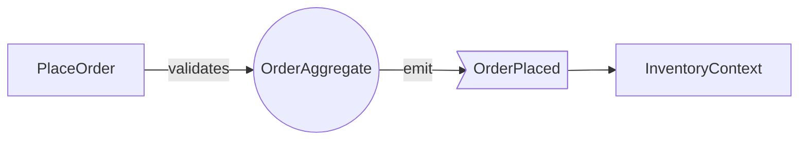

# DDD Rulebook for AI Agents (rules.md)

> **Purpose**: This `rules.md` helps AI agents (LLMs, automation bots) consistently apply **Domain-Driven Design (DDD)** so that generated code and models stay **highly cohesive** and maintainable.
>
> **Scope**: Application, Domain, and Infrastructure layers — code generation, refactoring, review comments, test generation, and documentation.

---

## 0. Notation

- **MUST / MUST NOT**: Strictly required / prohibited
- **SHOULD / SHOULD NOT**: Strong recommendation (explain exceptions)
- **MAY**: Optional
- Assign unique rule IDs (e.g., `DDD-COH-001`).

---

## 1. Bounded Contexts

- **DDD-CTX-001 (MUST)**: Split the system into **Bounded Contexts** so that vocabulary and use cases don’t collide. Aim for independent deployability.
- **DDD-CTX-002 (MUST)**: Cross-context dependencies go only through **public interfaces** (APIs, Events, ACL). No direct coupling to internal types/rules.
- **DDD-CTX-003 (SHOULD)**: Provide a **Context Map** (Upstream/Downstream, ACL, Shared Kernel, Open Host) in the README.

---

## 2. Ubiquitous Language

- **DDD-UL-001 (MUST)**: Keep domain terms consistent across code (classes, methods, events), tests, and docs.
- **DDD-UL-002 (MUST)**: Avoid vague names (e.g., data, info, process, handle). Prefer **verb + noun** with domain meaning.
- **DDD-UL-003 (SHOULD)**: Name Entities/Value Objects/Events to reflect **state change** and **tense** (e.g., `OrderPlaced`).

---

## 3. Cohesion — the most important idea

### 3.1 Core Principles

- **DDD-COH-001 (MUST)**: A type/module contains behavior only if it enforces the same **invariants** or the same **business decision**.
- **DDD-COH-002 (MUST)**: Objects inside an Aggregate MUST NOT be changed directly from outside. Mutations go through the **Aggregate Root**.
- **DDD-COH-003 (SHOULD)**: From “**one reason to change**,” split code so items with different reasons live in different files/classes/modules (SRP).
- **DDD-COH-004 (SHOULD)**: Prefer **proximity of data and behavior**. Keep domain rules in the **Domain Model**; Application layer orchestrates only.

### 3.2 Cohesion Review Checklist

- Where are invariants defined/enforced? Are they **contained within the aggregate root**?
- Are method parameters long/excessive? Can you **promote them to Value Objects**?
- Do names reflect the **Ubiquitous Language**? Remove ambiguous names like `process()`.
- Do use cases require **cross-aggregate transactional consistency**? If yes, **revisit boundaries**.
- Does the Application layer hold **calculation/validation logic**? Move it into the Domain.

### 3.3 Anti-Patterns

- **Anemic Model**: Domain objects are mere data buckets. → Move rules/calculations into objects.
- **God Service**: Application service hoards domain knowledge. → Split responsibilities; move rules to the model.
- **Chatty DTOs**: Excess mappers/DTOs hollow out the model. → Use meaningful Value Objects.

---

## 4. Aggregates

- **DDD-AGG-001 (MUST)**: An Aggregate is a **consistency boundary**. Define the unit within which all invariants hold in a single transaction.
- **DDD-AGG-002 (MUST)**: External references are **by ID only**. No direct reference/update of internal entities.
- **DDD-AGG-003 (SHOULD)**: Size for the **minimum consistency** needed (oversized aggregates hurt concurrency/locking).
- **DDD-AGG-004 (SHOULD)**: Achieve inter-aggregate consistency via **Domain Events** and **eventual consistency**.

**Example: design from minimum consistency**



---

## 5. Modeling Elements

### 5.1 Entity

- **DDD-ENT-001 (MUST)**: Identity is defined by an **ID**. Equality is ID-based.
- **DDD-ENT-002 (SHOULD)**: Provide factories/constructors that satisfy invariants at creation time.

### 5.2 Value Object

- **DDD-VO-001 (MUST)**: Immutable; equality over **all fields**; no side effects.
- **DDD-VO-002 (SHOULD)**: Encapsulate validation and **assign meaning** to primitive clusters; shorten parameter lists.

### 5.3 Domain Service

- **DDD-DS-001 (MUST)**: Use only when behavior **does not naturally belong** to a single Entity/Aggregate.
- **DDD-DS-002 (SHOULD)**: Keep it stateless; reflect side effects explicitly on Aggregates.

### 5.4 Repository

- **DDD-REP-001 (MUST)**: Persist per Aggregate Root. Basic API: `save(aggregate)` / `find(id)`.
- **DDD-REP-002 (SHOULD)**: Use **intention-revealing** queries (e.g., `findPendingOrdersBefore(date)`).

### 5.5 Domain Event

- **DDD-EVT-001 (MUST)**: Name in **past tense**; payload holds **facts** only.
- **DDD-EVT-002 (SHOULD)**: Use to mediate **eventual consistency**. Design handlers for retries/out-of-order.

---

## 6. Architecture Layers

- **DDD-ARC-001 (MUST)**: Layered or Hexagonal (Ports & Adapters). **Domain depends on nothing external**.
- **DDD-ARC-002 (MUST)**: Application layer **orchestrates use cases only**. Put rules/calculations in Domain.
- **DDD-ARC-003 (SHOULD)**: Isolate infra details (ORM/HTTP/Queue) in **Adapters**.
- **DDD-ARC-004 (SHOULD)**: Use **ACL (Anti-Corruption Layer)** for heterogeneous context integration.

---

## 7. Code Conventions & Review (Cohesion-first)

### 7.1 Naming

- **DDD-NAM-001 (MUST)**: Names reflect the **Ubiquitous Language**. Register abbreviations in a project glossary.
- **DDD-NAM-002 (SHOULD)**: Use-Case classes: `VerbNoun` (e.g., `ApprovePayment`). Events: `NounVerbPast` (e.g., `PaymentApproved`).

### 7.2 Dependencies

- **DDD-DEP-001 (MUST)**: Do not point dependencies **from inner to outer** layers. Domain must not depend on external packages.
- **DDD-DEP-002 (SHOULD)**: Invert implementation dependencies via **interfaces** (DI).

### 7.3 Testing

- **DDD-TST-001 (MUST)**: Domain tests verify **behavior** and **invariants** (minimize state exposure).
- **DDD-TST-002 (SHOULD)**: Application tests are **scenario-based** (Given-When-Then per use case).

### 7.4 PR Checklist

- Are aggregate boundaries explicit?
- Where are invariants upheld?
- Are rules concentrated in the Domain layer?
- Is any service hoarding domain knowledge?
- Do names reflect the Ubiquitous Language?

---

## 8. Small Example (pseudo-code)

```kotlin
// Value Object
data class Money(val amount: BigDecimal, val currency: String) {
  init { require(amount >= BigDecimal.ZERO) }
  fun add(other: Money): Money {
    require(currency == other.currency)
    return Money(amount + other.amount, currency)
  }
}

// Aggregate Root
class Order(private val id: OrderId, private val lines: MutableList<OrderLine>) {
  fun addLine(productId: ProductId, price: Money, qty: Int) {
    require(qty > 0)
    lines.add(OrderLine(productId, price, qty))
    // Invariant: total non-negative; single currency
    require(lines.map { it.price.currency }.toSet().size == 1)
  }
  fun place(): DomainEvent = OrderPlaced(id, total())
  fun total(): Money = lines.map { it.subtotal() }.reduce { a, b -> a.add(b) }
}
```

---

## 9. Directory Standard (example)

```
/apps
  /billing
    /application   # use cases (services, commands, handlers)
    /domain        # entities, value objects, repositories, events
    /infrastructure# DB/HTTP/Queue adapters
    /interfaces    # REST/GraphQL/CLI endpoints
```

---

## 10. Refactoring Guidelines (to raise cohesion)

- **DDD-REF-001 (MUST)**: Split long methods by extracting **Value Objects** / meaningful methods.
- **DDD-REF-002 (SHOULD)**: Replace primitive clusters with **Value Objects**.
- **DDD-REF-003 (SHOULD)**: Extract cross-cutting rules into **Domain Events/Policies**.
- **DDD-REF-004 (SHOULD)**: If multiple aggregates require a single transaction, **shrink boundaries** and move to **event-driven** with eventual consistency.

---

## 11. Prompt Templates for AI Agents

### 11.1 Design Tasks

```
For the given use case:
1) Identify Bounded Contexts and list the Ubiquitous Language.
2) Define aggregate consistency boundaries and invariants.
3) Design Entities/Value Objects/Services/Events.
4) Specify where invariants are enforced.
5) Separate Application orchestration from external I/O (Ports/Adapters).
```

### 11.2 Review Tasks

```
For the submitted code, inspect and respond with findings + fixes:
- Are invariants enforced within aggregate roots?
- Does domain knowledge live in the Domain layer?
- Do names follow the Ubiquitous Language?
- Opportunities for Value Objects?
- Are cross-aggregate concerns handled via events?
```

---

## 12. Definition of Done (DoD)

- Aggregate boundaries, invariants, and events are **documented**.
- Automated tests cover **happy path, boundaries, and errors** for each use case.
- No **knowledge leakage** from Application to Domain.
- Public API contracts (inputs/outputs/events) are explicit.

---

## 13. ADR Template

```
# ADR-XXXX: {Decision}
- Status: Proposed / Accepted / Deprecated
- Context: {background & constraints}
- Decision: {chosen approach}
- Alternatives: {compared and rejected}
- Consequences: {pros/cons, migration, risks}
```

---

## Appendix: Typical Cohesion Anti-Patterns & Fixes

- **God Object** → Re-slice aggregates; introduce Domain Events.
- **DTO Relay** → Promote to Value Objects/Domain Models.
- **Over-extended Transactions** → Minimize consistency boundary; make async.
- **Ambiguous Naming** → Update glossary and rename.

---

> **TL;DR**: Cohesion = **which invariants are enforced, and where**. Keep aggregates small, push knowledge into the domain, and use events for inter-aggregate consistency to get change-resilient, robust code.
