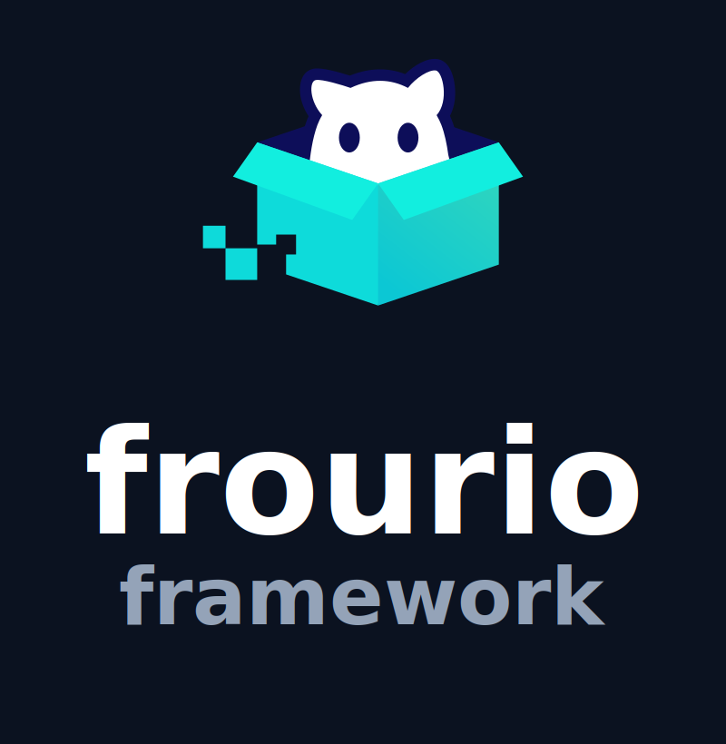

<p align="center">
  
</p>

# Frourio Framework

A full-stack TypeScript framework combining Next.js frontend with Fastify backend, featuring type-safe API communication and modern development tools.

## Architecture Overview

This repository follows a monorepo structure with clear separation between frontend and backend applications:

```
frourio-framework/
├── frontend-web/          # Next.js frontend application
├── backend-api/           # Fastify backend API
├── scripts/              # Deployment and utility scripts
├── Docker/               # Docker configuration files
└── docker-compose.yml    # Local development database
```

### Technology Stack

#### Backend API (`backend-api/`)

- **Framework**: [Fastify](https://fastify.dev/) - High-performance Node.js web framework
- **Language**: TypeScript with strict type checking
- **Database**: PostgreSQL with [Prisma](https://prisma.io/) ORM
- **API Generation**: [Frourio](https://frourio.com/) for type-safe API development
- **Authentication**: JWT with admin/user role separation
- **Testing**: Vitest with Prisma Fabbrica for test data generation
- **Build Tool**: ESBuild for fast compilation

#### Frontend Web (`frontend-web/`)

- **Framework**: [Next.js 15](https://nextjs.org/) with React 19
- **Language**: TypeScript with strict type checking
- **Styling**: [Tailwind CSS](https://tailwindcss.com/) with [Flowbite](https://flowbite.com/) components
- **State Management**: [Jotai](https://jotai.org/) for atomic state management
- **Data Fetching**: [SWR](https://swr.vercel.app/) with type-safe API client
- **Forms**: React Hook Form with Zod validation
- **Storage**: Supabase integration for file uploads
- **Testing**: Vitest for unit testing

#### Shared Infrastructure

- **Type Safety**: Aspida for end-to-end type safety between frontend and backend
- **Code Generation**: Automatic API client and path generation
- **Database**: PostgreSQL with Docker for local development
- **Deployment**: Support for Railway, AWS Amplify, and ECS

### Key Features

#### Type-Safe API Communication

- **Aspida**: Generates type-safe API clients from backend route definitions
- **Shared Types**: Common types and constants shared between frontend and backend
- **Automatic Generation**: API clients and route paths generated automatically

#### Authentication System

- **Dual Role System**: Separate authentication for admin and user roles
- **JWT Tokens**: Secure token-based authentication
- **Middleware**: Route protection with role-based access control

#### Database Management

- **Prisma ORM**: Type-safe database operations with automatic migrations
- **Code Generation**: Database models and factory functions auto-generated
- **Seeding**: Separate seed files for development and production environments

#### Development Experience

- **Hot Reload**: Both frontend and backend support hot reloading
- **Parallel Development**: Run both applications simultaneously with `npm run dev`
- **Type Checking**: Continuous type checking across the entire stack
- **Linting**: Consistent code style with ESLint and Prettier

### Directory Structure

#### Backend API Structure

```
backend-api/
├── api/                  # API route definitions (Frourio)
├── app/                  # Application utilities and helpers
├── config/               # Configuration files (CORS, JWT, etc.)
├── domain/               # Domain models and business logic
├── middleware/           # Authentication and request middleware
├── prisma/               # Database schema, migrations, and seeds
├── service/              # Application services and Fastify setup
└── tests/                # Test files and setup
```

#### Frontend Web Structure

```
frontend-web/
├── src/
│   ├── components/       # Reusable UI components
│   ├── features/         # Feature-specific code (auth, UI hooks)
│   ├── layouts/          # Page layout components
│   ├── pages/            # Next.js pages and API routes
│   ├── styles/           # Global styles and Tailwind config
│   ├── utils/            # Utility functions and API clients
│   └── views/            # Page view components
└── public/               # Static assets
```

## Ecosystem

- [frourio-framework-prisma-generators](https://github.com/InterfaceX-co-jp/frourio-framework-prisma-generators)
  - prisma generator that keeps your DX and speed 🚀

## Root Commands

```bash
# At root dir
cd frourio-framework
```

Setup .env

```bash
# With makefile
make env-setup-local
```

Run the app

```bash
# Let's run DB containers to begin with
docker-compose up -d

# Run npm install for all the directories
make install

# Run dev server for both frontend & backend
npm run dev
```

## Use Supabase At Local Environment

①

```bash
# move directory to frontend
cd frontend-web
```

②

```bash
# initialize supabase cofiguration
npx supabase init
```

③

```bash
# Let's staet Supabase
npx supabase start
```

After a moment, local keys and configurations will be generated.

④

Create fields for "NEXT_PUBLIC_SUPABASE_URL" and "NEXT_PUBLIC_SUPABASE_ANON_KEY" in your .env.local file,
and set their values to the "API URL" and "anon key", respectively.

⑤

Access the Studio URL for initial setup.

    1)Navigate to the Storage section and create a new bucket.

    2)Go to the Policies section under Storage and create your storage policies (make sure to pay attention to the bucket name, folder name, and allowed file extensions, as they are case-sensitive).

⑥

Finally, call the API to perform actual uploads and other operations.

## Enter ECS tasks in the Staging environment via SSM Session Manager

### What you need

- AWS CLI
- [AWS SSM Plugin](https://docs.aws.amazon.com/ja_jp/systems-manager/latest/userguide/session-manager-working-with-install-plugin. html)

### Reference.

- [SSH connection to ECS Fargate using SSM (Qiita)](https://qiita.com/kouji0705/items/005ea6d7c21ddd24ebb3)

```bash
$ cd frourio-framework
$ sh . /scripts/ecs_exec_stg -t ((task-id)) # Example) . /scripts/ecs_exec_stg -t 941f8694308b4adea44cb07ff9e50c30
```

## Deployment config

### Railway

[](https://railway.com/template/yiamej?referralCode=NtAl-c)

### AWS Amplify(frontend)

```yml
version: 1
applications:
  - frontend:
      phases:
        preBuild:
          commands:
            - cd ../
            - npm install --prefix frontend-web
            - npm install --prefix backend-api
        build:
          commands:
            - cd frontend-web
            - npm run build
      artifacts:
        baseDirectory: .next
        files:
          - "**/*"
      cache:
        paths:
          - .next/cache/**/*
          - .npm/**/*
    appRoot: frontend-web
```
